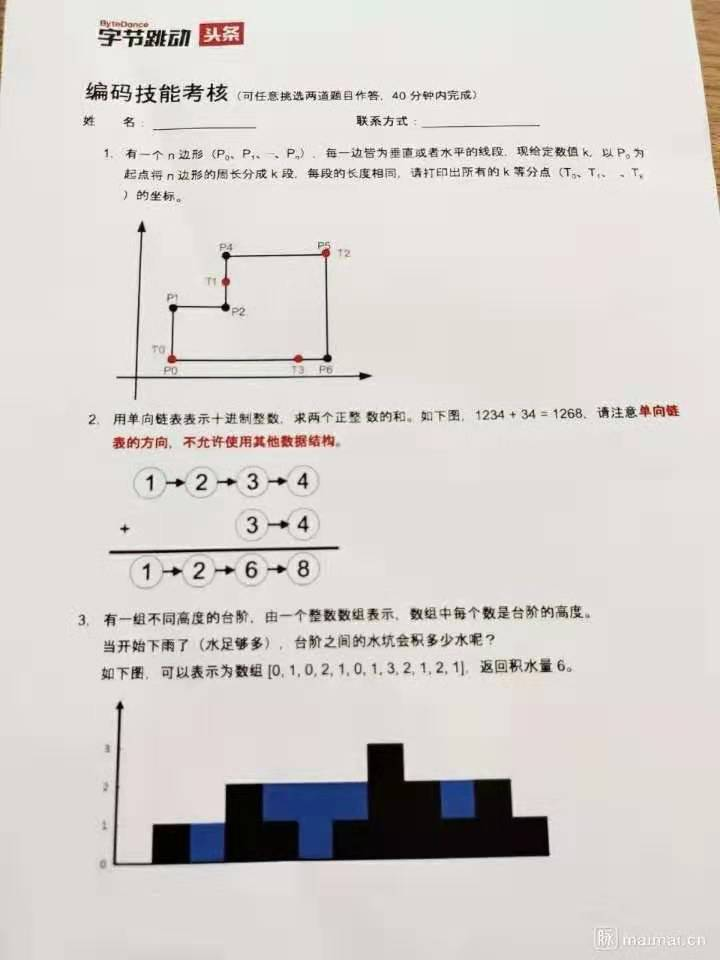

# LeetCodes
[leetcode](https://leetcode-cn.com/) 刷题

## Linked List(链表)

1. 给出两个**非空**的链表用来表示两个非负的整数。其中，它们各自的位数是按照**逆序**的方式存储的，并且它们的每个节点只能存储**一位**数字。

   如果，我们将这两个数相加起来，则会返回一个新的链表来表示它们的和。

   您可以假设除了数字 0 之外，这两个数都不会以 0 开头。

   > 示例：

   ```
   输入：(2 -> 4 -> 3) + (5 -> 6 -> 4)
   输出：7 -> 0 -> 8
   原因：342 + 465 = 807
   ```

   leetcode链接：https://leetcode-cn.com/problems/add-two-numbers
   
   github源码: https://github.com/binchencoder/LeetCodes/blob/master/src/main/java/com/binchencoder/leetcodes/linkedlist/AddTwoNumbers.java

# Interview

互联网大厂面试笔试题

## ByteDance


																						**2019/11/04**